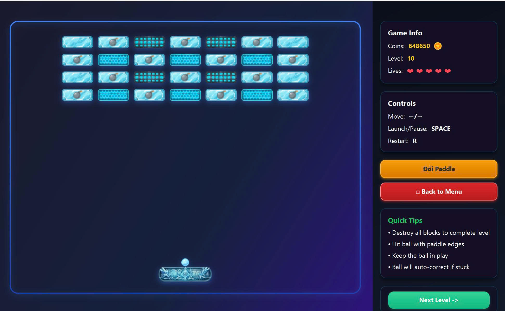
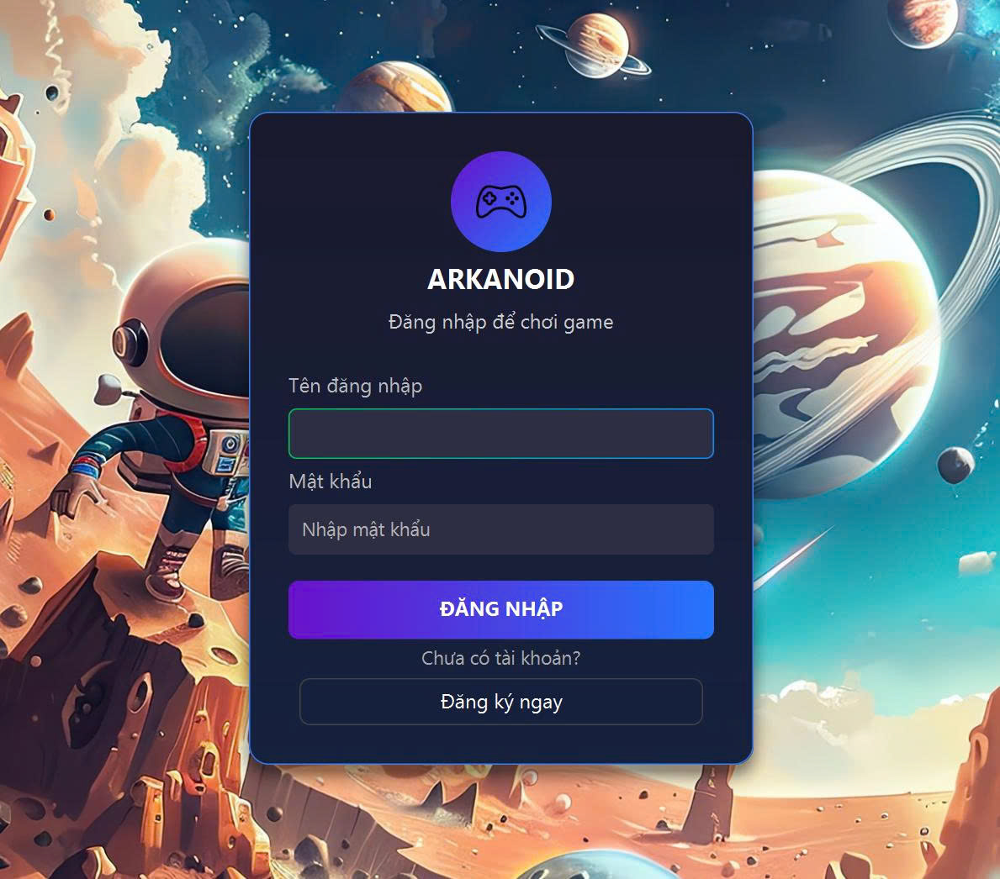
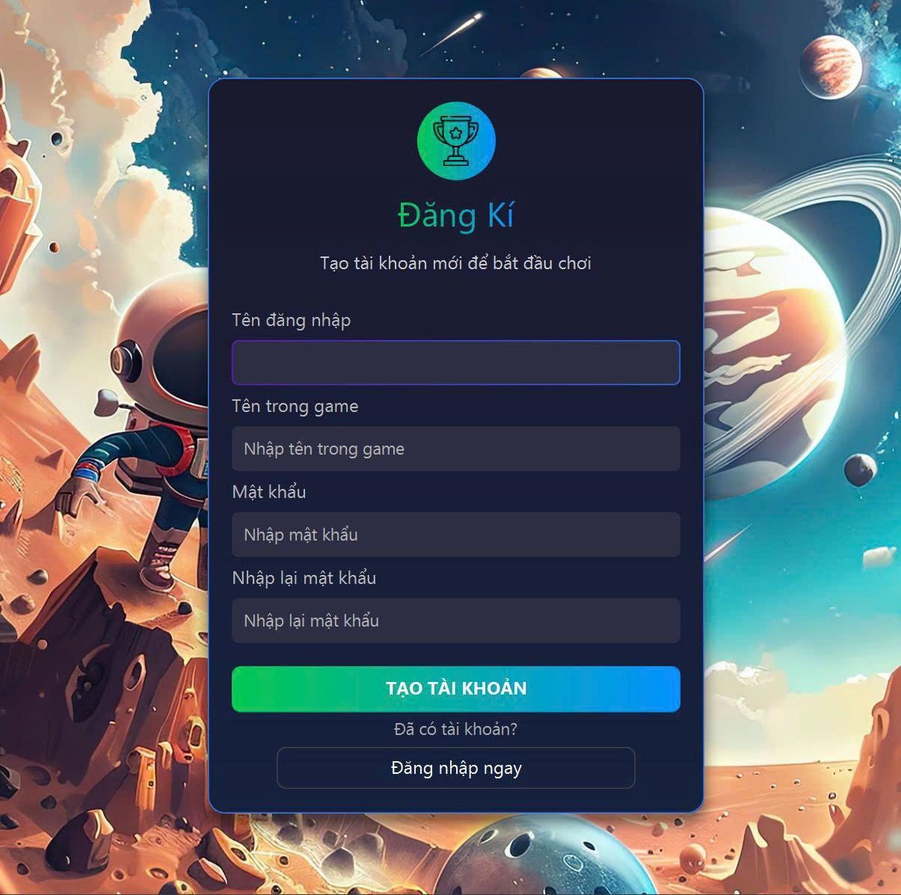
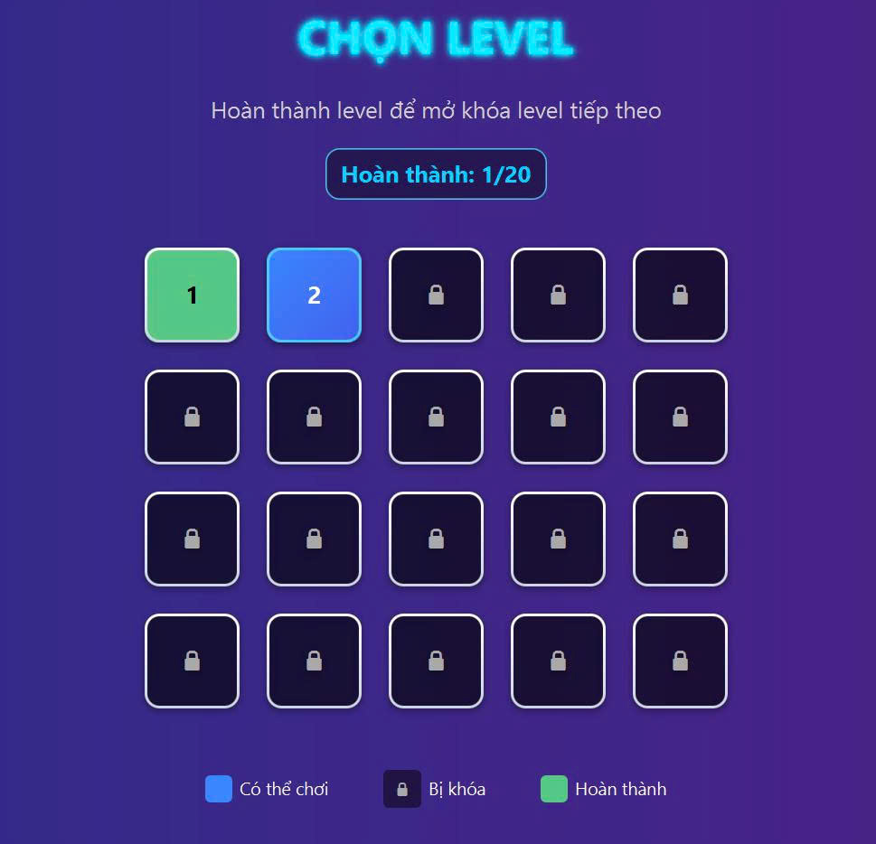
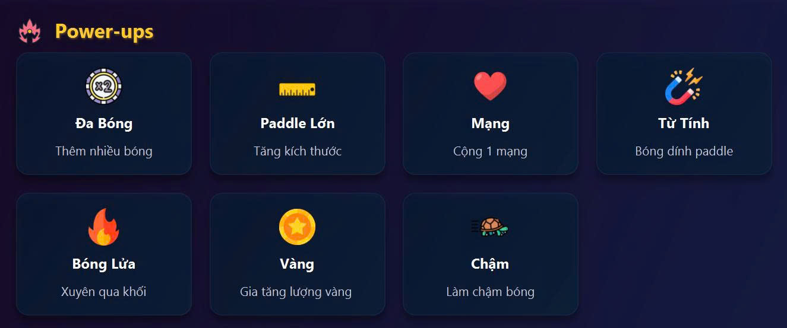
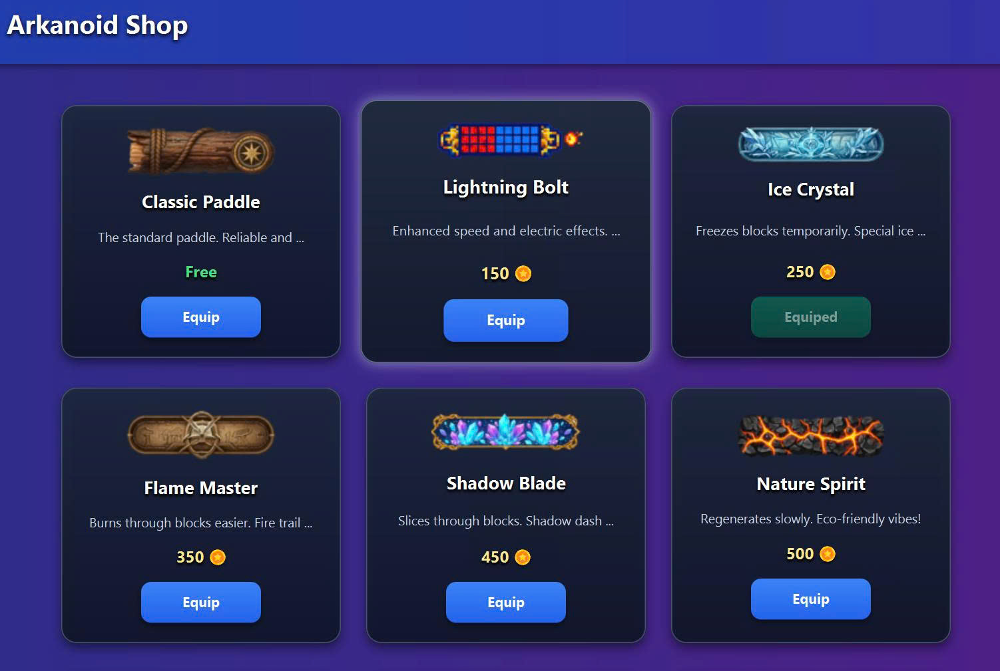
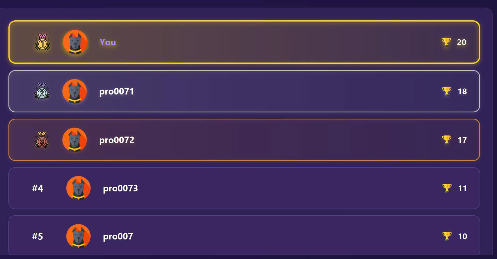

<h1 align="center">🎮 GAME ARKANOID - JavaFX</h1>

  

---

## 🧩 Thông tin dự án
- **Tên dự án:** Game Arkanoid - JavaFX
- **Thời gian thực hiện:** 25/09/2025 – 8/11/2025

---

## 👥 Thành viên nhóm

<table border="1" cellspacing="0" cellpadding="10" style="border-collapse: collapse; width: 100%; text-align: left;">
  <thead style="background-color: #f2f2f2;">
    <tr>
      <th>👤 Họ và tên</th>
      <th>🎯 Vai trò</th>
      <th>🧩 Nhiệm vụ chính</th>
    </tr>
  </thead>
  <tbody>
    <tr>
      <td><strong>Nguyễn Văn Huy</strong></td>
      <td><em>Nhóm trưởng</em></td>
      <td>
        Quản lý và định hướng toàn bộ tiến trình dự án.  
        Thiết kế và xây dựng <strong>giao diện người dùng (UI)</strong> trong game.  
        Dựng nền cơ bản, phát triển hệ thống <strong>service nội bộ</strong> gồm:  
        <ul>
          <li>🎵 Hệ thống âm thanh (Audio Service)</li>
          <li>💾 Quản lý tiến trình game (Game Progress Service)</li>
          <li>🔐 Xác thực người chơi (Authentication)</li>
          <li>🗄️ Kết nối và thao tác với cơ sở dữ liệu (Database Service)</li>
        </ul>
      </td>
    </tr>
    <tr>
      <td><strong>Đặng Trần Hải Đăng</strong></td>
      <td><em>Thành viên</em></td>
      <td>
        Phát triển và tối ưu các <strong>đối tượng tương tác trong game</strong> gồm:  
        <ul>
          <li>🧱 Thanh đỡ (Paddle)</li>
          <li>⚪ Quả bóng (Ball)</li>
          <li>⚡ Vật phẩm tăng sức mạnh (PowerUp)</li>
        </ul>
        Chịu trách nhiệm kiểm thử logic vật lý, va chạm và hành vi của đối tượng trong từng màn chơi.
      </td>
    </tr>
    <tr>
      <td><strong>Bùi Phan Quang Huy</strong></td>
      <td><em>Thành viên</em></td>
      <td>
        Phụ trách <strong>thiết kế mỹ thuật và hiệu ứng</strong> trong game:  
        <ul>
          <li>🎨 Tìm kiếm và xử lý hình ảnh, âm thanh</li>
          <li>🧱 Xây dựng đối tượng Brick và cơ chế phá vỡ</li>
          <li>🗺️ Thiết kế hệ thống màn chơi (Level Design)</li>
          <li>💥 Phát triển animation, hiệu ứng và trải nghiệm người chơi</li>
          <li>📝 Thiết kế tài liệu README và phần mô tả dự án</li>
        </ul>
      </td>
    </tr>
  </tbody>
</table>

---

## 🕹️ Tính năng Game

### 1️⃣ Hệ thống tài khoản
- Đăng ký tài khoản (username, password, player name)
- Đăng nhập hệ thống
- - Lưu trữ thông tin người chơi (điểm số, cup, coins)

  

  

---

### 2️⃣ Gameplay
- **20 Level** với độ khó tăng dần
- **4 loại gạch đa dạng:**
    - 🧱 Gạch thường (Normal Brick)
    - 🧱 Gạch cứng (Strong Brick) — cần đập nhiều lần
    - 💥 Gạch nổ (Explosive Brick) — phá hủy gạch xung quanh
    - 🚫 Gạch không thể phá hủy (Unbreakable Brick)

  

#### Power-ups
Có **7 loại Power-up** độc đáo giúp gameplay sinh động:
1. 🔥 FireBall — biến bóng thành bóng lửa
2. 🐢 SlowBall — làm chậm tốc độ bóng
3. ⚽ MultiplyBall — nhân đôi số lượng bóng
4. ⬛ ExpandPaddle — tăng kích thước paddle
5. ❤️ ExtraLife — thêm mạng
6. 💰 CoinPowerUp — nhận thêm coins
7. 🧩 PowerUpManager — quản lý các power-up

  

---

### 3️⃣ Các tính năng phụ trợ
- 🏪 **Shop System:** nhiều loại paddle và hiệu ứng khác nhau
- 🏆 **Bảng xếp hạng:** theo số cup của người chơi
- 📖 **Hướng dẫn chơi chi tiết**
- 💫 **Animation & Hiệu ứng nổ đẹp mắt**
- 🔊 **Hệ thống âm thanh sống động**

  

  

  

---

## 🧠 Cấu trúc Source Code

<pre>
src/
│
├───main/
│   ├───java/
│   │   ├───module-info.java                 # Thông tin module JavaFX (định nghĩa module, xuất package)
│   │   │
│   │   └───vibe/com/demo/
│   │       │
│   │       ├───MainApp.java                 # Điểm khởi chạy ứng dụng (entry point)
│   │       │
│   │       ├───controller/                 # Các lớp điều khiển giao diện và tương tác người dùng (FXML Controller)
│   │       │       BaseController.java
│   │       │       FormController.java
│   │       │       LoginController.java
│   │       │       SignupController.java
│   │       │       LobbyController.java
│   │       │       GameViewController.java
│   │       │       LevelMenuController.java
│   │       │       RankingController.java
│   │       │       ShopController.java
│   │       │       GameHelpController.java
│   │       │       └── ... (các controller khác nếu có)
│   │       │
│   │       ├───game/                       # Logic xử lý game Arkanoid
│   │       │   ├───core/                   # Lõi game: vòng lặp, render, quản lý va chạm, engine
│   │       │   │       GameEngine.java
│   │       │   │       Renderer.java
│   │       │   │       CollisionDetector.java
│   │       │   │       GameDataModel.java
│   │       │   │       GameManager.java
│   │       │   │
│   │       │   ├───animations/             # Quản lý hiệu ứng hình ảnh (nổ, cháy, paddle, bóng)
│   │       │   │       AnimationManager.java
│   │       │   │       AnimationType.java
│   │       │   │       SpriteAnimation.java
│   │       │   │       BrickDestroyAnimation.java
│   │       │   │
│   │       │   ├───levels/                 # Quản lý level: đọc file, tạo map, lưu tiến trình
│   │       │   │       LevelConfig.java
│   │       │   │       LevelLoader.java
│   │       │   │       LevelManager.java
│   │       │   │       LevelDesigner.java
│   │       │   │
│   │       │   ├───objects/                # Các đối tượng trong game (bóng, gạch, paddle, power-up,…)
│   │       │   │   ├───abstractions/       # Các lớp trừu tượng cho game object
│   │       │   │   ├───entities/           # Thực thể chính trong game (ball, brick, paddle,…)
│   │       │   │   ├───factories/          # Factory pattern tạo đối tượng (BrickFactory, PowerUpFactory,…)
│   │       │   │   └───powerups/           # Các loại power-up (coin, fireball, expand paddle,…)
│   │       │   │
│   │       │   └───utils/                  # Hằng số, tiện ích phụ trợ cho game
│   │       │           GameConstants.java
│   │       │
│   │       ├───model/                      # Dữ liệu mô hình (Model) của người chơi và game
│   │       │   ├───user/                   # Thông tin người dùng
│   │       │   │       User.java
│   │       │   │
│   │       │   └───game/                   # Tiến trình và dữ liệu người chơi trong game
│   │       │           PlayerProgress.java
│   │       │
│   │       └───service/                    # Lớp xử lý nghiệp vụ (Service layer)
│   │           │
│   │           ├───auth/                   # Xác thực và đăng nhập người dùng
│   │           │       AuthService.java
│   │           │
│   │           ├───audio/                  # Quản lý âm thanh và nhạc nền
│   │           │       AudioService.java
│   │           │
│   │           ├───database/               # Tầng dữ liệu (Data Access Layer)
│   │           │   ├───dao/                # Data Access Object pattern
│   │           │   │   ├───abstraction/    # Lớp cơ sở trừu tượng cho DAO
│   │           │   │   ├───interfaces/     # Interface định nghĩa hành vi DAO
│   │           │   │   └───objectdao/      # DAO cụ thể (UserDao, ...)
│   │           │   │
│   │           │   └───utils/              # Công cụ kết nối CSDL
│   │           │           DatabaseConnection.java
│   │           │
│   │           ├───game/                   # Dịch vụ quản lý tiến trình game
│   │           │       GameProgressService.java
│   │           │
│   │           ├───user/                   # Quản lý người dùng
│   │           │       UserService.java
│   │           │
│   │           └───ServiceLocator.java     # Quản lý các service (dependency injection)
│   │
│   └───resources/
│       └───vibe/com/demo/
│           ├───assets/                     # Tài nguyên game
│           │   ├───css/                    # Giao diện (CSS cho từng màn hình)
│           │   ├───img/                    # Hình ảnh (logo, gạch, bóng, vật phẩm, icon,…)
│           │   └───sounds/                 # Âm thanh và nhạc nền (mp3)
│           │
│           ├───db/                         # File cấu trúc cơ sở dữ liệu (SQL schema)
│           │       arkanoid.sql
│           │
│           └───fxmlFiles/                  # File giao diện FXML (scene)
│                   login.fxml
│                   signup.fxml
│                   lobby.fxml
│                   gameview.fxml
│                   levelmenu.fxml
│                   ranking.fxml
│                   shop.fxml
│                   gameHelp.fxml
│
└───test/ 
        # Chưa phát triển

</pre>

---

## ⚙️ Công nghệ sử dụng
☕ Java 21 – Ngôn ngữ chính để phát triển toàn bộ ứng dụng

🎨 JavaFX – Framework giao diện đồ họa (UI framework)

🗄️ MySQL – Hệ quản trị cơ sở dữ liệu lưu trữ thông tin người dùng và tiến trình game
⚙️ Maven – Công cụ quản lý dependency và build project

🤖 ChatGPT (OpenAI) – Hỗ trợ phân tích, gợi ý thuật toán và tối ưu mã nguồn

🧠 GitHub Copilot – Trợ lý AI hỗ trợ gợi ý code thông minh trong IDE

🌐 GitHub – Nền tảng quản lý mã nguồn, phân nhánh, commit và cộng tác nhóm
---